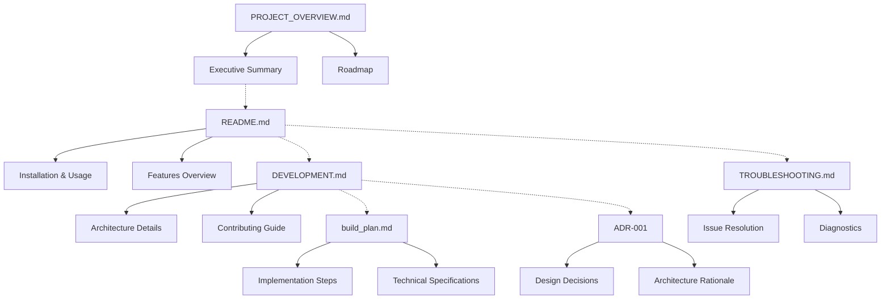

# Documentation Index

This directory contains comprehensive documentation for the Chezmoi Template Syntax VS Code extension.

## 📚 Documentation Structure

### 🏠 Main Documentation
- **[../README.md](../README.md)** - Project overview, features, installation, and usage guide
- **[../CHANGELOG.md](../CHANGELOG.md)** - Version history and release notes

### 🛠️ Development Documentation
- **[DEVELOPMENT.md](DEVELOPMENT.md)** - Developer setup, architecture, and contribution guide
- **[build_plan.md](build_plan.md)** - Detailed implementation and build process guide
- **[PROJECT_OVERVIEW.md](PROJECT_OVERVIEW.md)** - High-level project summary and roadmap

### 🔧 Operational Documentation
- **[TROUBLESHOOTING.md](TROUBLESHOOTING.md)** - Issue diagnosis and resolution guide
- **[adr-001-chezmoi-syntax-highlighting-architecture.md](adr-001-chezmoi-syntax-highlighting-architecture.md)** - Architecture Decision Record

## 🗂️ Quick Navigation

### For End Users
Start with the **[main README](../README.md)** for installation and usage instructions. If you encounter issues, consult the **[Troubleshooting Guide](TROUBLESHOOTING.md)**.

### For Developers
Begin with **[DEVELOPMENT.md](DEVELOPMENT.md)** for setup and architecture overview. Review the **[Build Plan](build_plan.md)** for implementation details and the **[Architecture Decision Record](adr-001-chezmoi-syntax-highlighting-architecture.md)** for design rationale.

### For Project Stakeholders
See **[PROJECT_OVERVIEW.md](PROJECT_OVERVIEW.md)** for executive summary, technical specifications, and project roadmap.

## 📋 Documentation Standards

All documentation in this project follows these conventions:

### Structure Standards
- **Clear headings** with emoji icons for visual organization
- **Table of contents** for documents longer than 5 sections
- **Code examples** with syntax highlighting
- **Cross-references** between related documents

### Content Standards
- **User-focused language** avoiding unnecessary technical jargon
- **Step-by-step instructions** with numbered lists
- **Visual aids** including diagrams and screenshots where helpful
- **Troubleshooting sections** with common issues and solutions

### Maintenance Standards
- **Version synchronization** ensuring all references are current
- **Link validation** checking all internal and external links
- **Regular updates** reflecting changes in implementation
- **Feedback incorporation** based on user questions and issues

## 🔄 Document Relationships

## 📖 Reading Paths

### New User Journey
1. **[README.md](../README.md)** - Understand what the extension does
2. **[Installation section](../README.md#installation)** - Get the extension running
3. **[How It Works section](../README.md#how-it-works)** - Understand the technology
4. **[TROUBLESHOOTING.md](TROUBLESHOOTING.md)** - Resolve any issues

### Developer Journey
1. **[PROJECT_OVERVIEW.md](PROJECT_OVERVIEW.md)** - Understand project scope and goals
2. **[DEVELOPMENT.md](DEVELOPMENT.md)** - Set up development environment
3. **[build_plan.md](build_plan.md)** - Learn implementation details
4. **[ADR-001](adr-001-chezmoi-syntax-highlighting-architecture.md)** - Understand design decisions

### Maintainer Journey
1. **[DEVELOPMENT.md](DEVELOPMENT.md)** - Review current architecture
2. **[CHANGELOG.md](../CHANGELOG.md)** - Check version history
3. **[PROJECT_OVERVIEW.md](PROJECT_OVERVIEW.md)** - Review roadmap and metrics
4. **[TROUBLESHOOTING.md](TROUBLESHOOTING.md)** - Understand common user issues

## ✅ Documentation Checklist

When creating or updating documentation:

- [ ] **Audience appropriate** - Content matches intended readers
- [ ] **Accurate and current** - Information reflects current implementation
- [ ] **Complete coverage** - All features and use cases documented
- [ ] **Clear examples** - Practical examples for all concepts
- [ ] **Cross-referenced** - Links to related documentation
- [ ] **Searchable** - Good headings and keywords for finding content
- [ ] **Actionable** - Clear next steps for readers
- [ ] **Tested** - All code examples and instructions verified

## 🔗 External References

### VS Code Extension Development
- [VS Code Extension API](https://code.visualstudio.com/api)
- [TextMate Grammar Guide](https://macromates.com/manual/en/language_grammars)
- [Extension Publishing](https://code.visualstudio.com/api/working-with-extensions/publishing-extension)

### Chezmoi and Templates
- [Chezmoi Documentation](https://www.chezmoi.io/)
- [Go Template Documentation](https://pkg.go.dev/text/template)
- [Sprig Template Functions](http://masterminds.github.io/sprig/)

### Project Resources
- [GitHub Repository](https://github.com/applejxd/chezmoi-template-syntax)
- [VS Code Marketplace](https://marketplace.visualstudio.com/items?itemName=applejxd.chezmoi-template-syntax)
- [Issue Tracker](https://github.com/applejxd/chezmoi-template-syntax/issues)

---

*This documentation index is maintained to ensure all project documentation remains accessible and up-to-date. If you find broken links or missing information, please open an issue or submit a pull request.*