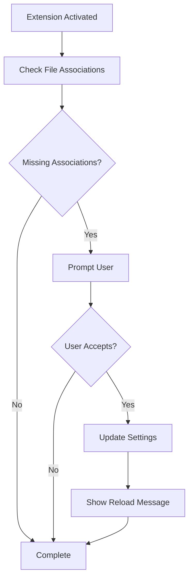

# Development Guide

This document provides detailed information for developers working on the Chezmoi extension.

## 📁 Project Structure

```
vscode-chezmoi/
├── 📄 README.md                           # Main project documentation
├── 📄 CHANGELOG.md                        # Release notes and version history
├── 📄 package.json                        # Extension manifest and dependencies
├── 📄 language-configuration.json         # Language behavior configuration
├── 📄 tsconfig.json                       # TypeScript configuration
├── 📄 eslint.config.mjs                   # ESLint configuration
├── 📄 .vscode-test.mjs                    # Test runner configuration
│
├── 📁 src/                                # TypeScript source code
│   ├── 📄 extension.ts                    # Main extension logic
│   └── 📁 test/
│       └── 📄 extension.test.ts           # Extension test suite
│
├── 📁 syntaxes/                           # TextMate grammar files
│   ├── 📄 chezmoi-templating.injection.tmLanguage.json  # Go Template injection
│   ├── 📄 chezmoi-tmpl.tmLanguage.json                  # Plain text base grammar
│   ├── 📄 chezmoi-sh-tmpl.tmLanguage.json               # Shell base grammar
│   ├── 📄 chezmoi-zsh-tmpl.tmLanguage.json              # Zsh base grammar
│   ├── 📄 chezmoi-ps1-tmpl.tmLanguage.json              # PowerShell base grammar
│   ├── 📄 chezmoi-py-tmpl.tmLanguage.json               # Python base grammar
│   └── 📄 chezmoi-toml-tmpl.tmLanguage.json             # TOML base grammar
│
├── 📁 test/fixtures/                      # Test template files
│   ├── 📄 test.tmpl                       # Generic template example
│   ├── 📄 test.sh.tmpl                    # Shell script template
│   ├── 📄 test.zsh.tmpl                   # Zsh script template
│   ├── 📄 test.ps1.tmpl                   # PowerShell script template
│   ├── 📄 test.py.tmpl                    # Python script template
│   └── 📄 test.toml.tmpl                  # TOML template
│
├── 📁 doc/                                # Documentation
│   ├── 📄 adr-001-chezmoi-syntax-highlighting-architecture.md
│   ├── 📄 build_plan.md                   # Implementation guide
│   └── 📄 DEVELOPMENT.md                  # This file
│
└── 📁 out/                                # Compiled JavaScript output
    ├── 📄 extension.js                    # Compiled extension
    └── 📁 test/
        └── 📄 extension.test.js           # Compiled tests
```

## 🔧 Core Architecture

### Language Definition System

The extension uses VS Code's language contribution system to define custom languages for each template type:

```typescript
// Custom Language IDs
"chezmoi-tmpl"      → "text.plain.chezmoi"        // Generic templates
"chezmoi-sh-tmpl"   → "source.shell.chezmoi"      // Shell templates
"chezmoi-zsh-tmpl"  → "source.zsh.chezmoi"        // Zsh templates
"chezmoi-ps1-tmpl"  → "source.powershell.chezmoi" // PowerShell templates
"chezmoi-py-tmpl"   → "source.python.chezmoi"     // Python templates
"chezmoi-toml-tmpl" → "source.toml.chezmoi"       // TOML templates
```

### Grammar Injection Pipeline

1. **File Recognition**: VS Code identifies `.tmpl` files using language definitions
2. **Base Grammar Application**: Applies appropriate base language grammar
3. **Template Injection**: Injects Go Template grammar into `{{ }}` expressions
4. **Scope Resolution**: Resolves to final combined syntax highlighting

### Extension Activation Flow



## 🛠️ Development Workflow

### Prerequisites

```bash
# Install dependencies
npm install

# Install VS Code extension development tools
npm install -g @vscode/vsce
```

### Daily Development

```bash
# Compile TypeScript
npm run compile

# Watch mode for auto-compilation
npm run watch

# Run linting
npm run lint

# Run tests
npm test

# Package extension
npm run package
```

### Debugging

1. **Extension Development Host**:
   - Open project in VS Code
   - Press `F5` to launch Extension Development Host
   - Open test files to verify functionality

2. **Grammar Inspection**:
   - Use `Developer: Inspect Editor Tokens and Scopes`
   - Verify `meta.embedded.block.go-template` scope in `{{ }}` expressions

3. **Test Coverage**:
   ```bash
   npm test -- --coverage
   ```

## 📝 Code Style and Standards

### TypeScript Guidelines

- Use strict TypeScript configuration
- Prefer `const` over `let` where possible
- Use proper type annotations for public APIs
- Follow VS Code extension patterns

### Documentation Standards

- All public functions must have JSDoc comments
- Include parameter descriptions and return types
- Provide usage examples for complex functions

Example:
```typescript
/**
 * Configures file associations for chezmoi template files.
 *
 * @param associations - Record of file patterns to language IDs
 * @param target - Configuration target (Global, Workspace, etc.)
 * @returns Promise that resolves when configuration is updated
 *
 * @example
 * ```typescript
 * await updateFileAssociations({
 *   "*.tmpl": "chezmoi-tmpl"
 * }, ConfigurationTarget.Global);
 * ```
 */
```

### Naming Conventions

- **Files**: kebab-case (`extension.test.ts`)
- **Variables/Functions**: camelCase (`updateFileAssociations`)
- **Constants**: UPPER_SNAKE_CASE (`ASSOCIATIONS`)
- **Types/Interfaces**: PascalCase (`LanguageConfiguration`)

## 🧪 Testing Strategy

### Test Structure

```typescript
suite('Extension Test Suite', () => {
  test('File language association', async () => {
    // Test file type recognition
  });

  test('Extension dependencies', () => {
    // Test Go Template extension availability
  });

  test('Language contributions', () => {
    // Test language registration
  });
});
```

### Adding New Tests

1. Create test in `src/test/extension.test.ts`
2. Follow existing patterns for async testing
3. Use descriptive test names
4. Include both positive and negative test cases

### Mock Testing

> **Note**: This project uses **Mocha** as its test framework.
> For mocking VS Code APIs, consider using [sinon](https://sinonjs.org/) or VS Code's built-in test utilities.

## 🏗️ Adding New Features

### Adding a New Template Type

1. **Update Language Definitions** (`package.json`):
   ```json
   {
     "id": "chezmoi-yaml-tmpl",
     "extensions": [".yaml.tmpl", ".yml.tmpl"],
     "configuration": "./language-configuration.json"
   }
   ```

2. **Create Grammar File** (`syntaxes/chezmoi-yaml-tmpl.tmLanguage.json`):
   ```json
   {
     "scopeName": "source.yaml.chezmoi",
     "patterns": [{ "include": "source.yaml" }]
   }
   ```

3. **Update Injection Targets**:
   ```json
   "injectTo": [
     "source.shell.chezmoi",
     "source.powershell.chezmoi",
     "text.plain.chezmoi",
     "source.yaml.chezmoi"
   ]
   ```

4. **Update Extension Logic** (`src/extension.ts`):
   ```typescript
   const ASSOCIATIONS: Record<string, string> = {
     // ... existing associations
     "*.yaml.tmpl": "chezmoi-yaml-tmpl",
     "*.yml.tmpl": "chezmoi-yaml-tmpl"
   };
   ```

5. **Add Test Cases**:
   - Create `test/fixtures/test.yaml.tmpl`
   - Add language association test

### Modifying Grammar Injection

Grammar injection rules are defined in `syntaxes/chezmoi-templating.injection.tmLanguage.json`:

```json
{
  "patterns": [
    {
      "begin": "\\{\\{\\-?",           // Matches {{ or {{-
      "end": "\\-?\\}\\}",             // Matches }} or -}}
      "contentName": "meta.embedded.block.go-template",
      "patterns": [
        { "include": "source.go-template" }  // Includes Go Template grammar
      ]
    }
  ]
}
```

## 🔍 Troubleshooting

### Common Issues

**Syntax highlighting not working**:
1. Check file is recognized with correct language ID
2. Verify Go Template extension is installed
3. Inspect token scopes with VS Code developer tools

**File associations not applied**:
1. Restart VS Code after enabling associations
2. Check VS Code settings for `files.associations`
3. Verify extension activation

**Grammar injection failing**:
1. Check `injectionSelector` targets correct scopes
2. Verify base language grammars are available
3. Test with simple template expressions first

### Debug Logging

Add debug logging to extension:
```typescript
import * as vscode from 'vscode';

const outputChannel = vscode.window.createOutputChannel('Chezmoi Syntax');

export function log(message: string): void {
  outputChannel.appendLine(`[${new Date().toISOString()}] ${message}`);
}
```

### Performance Profiling

Monitor extension activation time:
```typescript
export async function activate(context: vscode.ExtensionContext) {
  const start = Date.now();

  // Extension logic here

  const duration = Date.now() - start;
  console.log(`Extension activated in ${duration}ms`);
}
```

## 📦 Release Process

### Version Management

Follow semantic versioning:
- **Major** (1.0.0): Breaking changes
- **Minor** (0.1.0): New features
- **Patch** (0.0.1): Bug fixes

### Release Checklist

1. [ ] Update version in `package.json`
2. [ ] Update `CHANGELOG.md`
3. [ ] Run full test suite
4. [ ] Test extension in clean VS Code instance
5. [ ] Build and test VSIX package
6. [ ] Create git tag
7. [ ] Publish to marketplace

### Publishing Commands

```bash
# Increase version and publish
npm version patch  # or minor/major
npm run publish

# Or publish specific version
vsce publish 0.1.1
```

## 🤝 Contributing

### Pull Request Guidelines

1. Fork repository
2. Create feature branch: `git checkout -b feature/new-feature`
3. Make changes with tests
4. Update documentation
5. Submit pull request

### Code Review Checklist

- [ ] Code follows style guidelines
- [ ] Tests pass
- [ ] Documentation updated
- [ ] No breaking changes (or properly documented)
- [ ] Performance impact considered